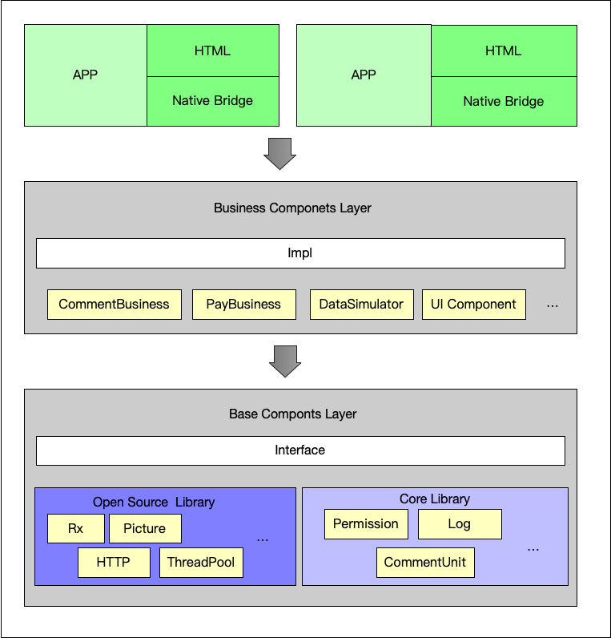

##  **一 简介**：

#### 本工程致力于帮助开发者快速构建标准Android工程，做到工程项目可持续集成，可测试。  

#### 项目蓝图



#### APP构建原则


## 二 **数据层**：

#####构建依赖：Rxjava，Room，Retrofit，Stetho，MockServer


#### **网络客户端构建**：

##### 说明：本项目中网络请求通过Retrofit+Okhttp 方式实现。通过packageName.data.network.Server 管理请求客户端的初始化与，通过Server.services（）对外暴露请求。  

##### Remote为网络服务仓库，构建及使用见Retrofit[官网](https://square.github.io/retrofit/)

##### 初始化

```kotlin
init {
    val logLevel = HttpLoggingInterceptor()
    logLevel.level = HttpLoggingInterceptor.Level.BODY

    val callClient = OkHttpClient.Builder()
        .addInterceptor(logLevel)
        .build()
    client = Retrofit.Builder()
        .baseUrl("")
        .addCallAdapterFactory(RxJava2CallAdapterFactory.create())
        .addConverterFactory(GsonConverterFactory.create())
        .client(callClient)
        .build()
}

fun services(): RemoteService {
    return client.create(RemoteService::class.java)
}
```

##### Services 对上层暴露Rx观察者

```kotlin
interface RemoteService {

    @POST("base/login")
    fun getOrderInfo(@Body user: UserInfo): Single<UserInfo>

    @GET("getWangYiNews")
    fun getNews(): Single<RestResponse<List<News>>>
}

data class RestResponse<T>(val code: Int, val message: String, val result: T)
```


#### **本地数据服务构建**

##### 说明：本项目目前只对database 做管理，kv，file 数据服务暂时未实现，请同学们自己实现。管理类packageName.data.database.DBRegister  

##### 数据库框架采用JetPack Room 组件，如何使用见[官网](https://developer.android.google.cn/training/data-storage/room?hl=zh-cn)

##### 初始化：在Application中 onCreate 函数中 使用 init（）函数初始化。  

```java
DBRegister.init(this,"dbName");
```

##### 数据表初化

```java
@Entity( tableName = "user_info",
         indices = { @Index(value = ("userId"), unique = true) } )
public class UserInfo {
    @NonNull
    @PrimaryKey
    public String userId;
  
    @ColumnInfo(name = "name")
    public String name;
  
    @ColumnInfo(name = "sex")
    public int sex;    //性别 0 男 1女
  
    @ColumnInfo(name = "birthday")
    public long birthday;

}
```

##### Dao初始化 对上层暴露Rx观察者

```kotlin
@Dao
interface UserDao {
    @Insert(onConflict = OnConflictStrategy.REPLACE)
    fun insert(userInfo: UserInfo): Completable
}
```


#### **对上层Repo构建**

##### 为防止耦合现象，数据层只应该对上层暴露Repo调用层 与 数据初始化相应类，Repo应按照一定规则建立（如，业务类型，接口版本）

##### Repo初始化 对上层暴露LiveData

```kotlin
class NewsRepo {

    private val services = Server.services()
    private val dao = DBRegister.db().newsDao()

    fun getNews(): LiveData<Resource<List<News>>> {
        return LiveDataReactiveStreams.fromPublisher(
            object : NetworkBoundResource<List<News>>() {
                override fun shouldFetch(data: List<News>?): Boolean {
                    return true
                }

                override fun loadFromDb(): Single<List<News>> {
                    return dao.find()
                }

                override fun createCall(): Single<RestResponse<List<News>>> {
                    return services.getNews()
                }

                override fun saveCallResult(source: List<News>): Completable {
                    return dao.insert(source)
                }
              
            }.asFlowable()
        )
    }
}
```

##### 说明，类：

- ##### *Resource：请求状态，包含 状态，数据信息，请求说明 三项内容*

- ##### *NetworkBoundResource:请求与状态绑定类，构建每条Service时需构建一个对象*

  - ###### 回调函数说明：

    - shouldFetch(data: T): Boolean : 判断是否从远端加载
    - loadFromDb(): Single<T> ：从数据库加载数据
    - createCall(): Single<RESP> : 从远端加载数据
    - saveCallResult(source: T) ：远端数据更新


#### **数据测试**，高阶用法详见[官网](https://developer.android.com/training/testing)

##### API 测试：

```kotlin
    //远端服务
    private val services = Server.services()

    @Test
    fun testNews() {
        val result = services.getNews().blockingGet()
        Assert.assertEquals(result.code, 200)
    }
```

##### DB测试：

```kotlin
@RunWith(AndroidJUnit4::class)
class NewsDaoTest {

    private lateinit var database: TimeLineDatabase

    @Before
    fun createDb() {
        database = Room.inMemoryDatabaseBuilder(
            InstrumentationRegistry.getInstrumentation().targetContext,
            TimeLineDatabase::class.java
        )
            .allowMainThreadQueries()
            .build()
    }

    @After
    fun closeDb() {
        database.close()
    }

    @Test
    fun testInsertUser() {
        val news = News(0, "path", "image", "title", "time")
        database.newsDao()
            .insert(news)
            .test()
            .assertComplete()
    }
}
```


## **三 视图**

#### ViewModel/Presenter：ViewModel 或者 Presenter 应只与下层产生关联（ Data 或者 domain ），只持有业务类或者Repo实例，只做触发Repo或者响应页面。

```kotlin
class SplashViewModel : ViewModel() {

    private val _query = MutableLiveData<String>()

    private var repo: NewsRepo = NewsRepo()

    var newsLiveData: LiveData<Resource<List<News>>> =
        Transformations.switchMap(_query) { repo.getNews(it) }

    fun refresh(var name:String) {
        _query.value = name
    }
}
```


#### Mock：创建FakeRepo，在已知下层接口情况下，意在脱离数据层开发。需自己配置 productFlavors ，与RepoInjection，RepInjection作为唯一跟接触Repo实例的门面类。


####拓展（packageName.expand）

#####ExpandAppCompatActivity.kt：addFragment，removeFragment，replaceFragment

#####ExpandFragmentManager.kt：set default Transaction


## **四 domain**

注：domain 层持有Rxjava 库，可配合Rx做业务开发，留给其他同学良好的代码阅读环境

- ##### 本次根据具体业务适当添加，例如：在面向接口开发的情况下，一条Service对应一条业务，其实并不需要本层。

- ##### 若复杂情况系下，一条业务需多条Service配合才能完成，则需要本层对其处理，暴露上层对应业务接口，上层只应持有本层实例